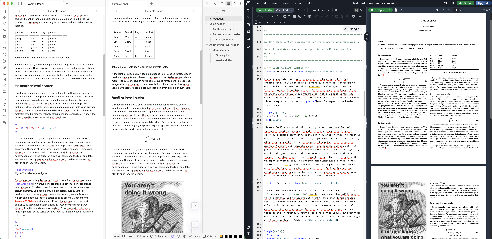

# Obsidian Markdown → LaTeX

Convert Obsidian notes (with wikilinks, embedded images, tables, and citations) into a LaTeX paper template. Place your Markdown file and attachments in the `Markdown/` folder, run the conversion script, and the content is injected into `LaTeX/main.tex` between the markers. No build folder—everything stays clean.

**LaTeX template used for demonstration**: This repo uses the [Elsevier High Energy Astrophysics Journal Template](https://www.overleaf.com/latex/templates/elsevier-high-energy-astrophysics-journal-template/tvmwymmkqvks) (Overleaf) based on the elsarticle class.



---

## Quick start

1. **Requirements**: [Pandoc](https://pandoc.org/) and Python 3
2. Place your Markdown file in `Markdown/` (e.g. `Markdown/Paper.md`)
3. Place images in `Markdown/attachments/` or directly in `Markdown/`
4. Place the paper template in `LaTeX/`
5. Insert the following markers in the `main.tex`:
``
% === BEGIN MARKDOWN CONTENT ===
``
and
``
% === END MARKDOWN CONTENT ===
``
in the template location, where your content should be inserted
6. [optionally] Add necessary package imports and commands to the `main.tex`; edit the `main.tex` to replace authors etc.
4. Run the conversion:
   - **macOS/Linux**: `./convert-md-to-tex.sh`
   - **Windows**: double‑click or run `convert-md-to-tex.bat`
5. Compile `LaTeX/main.tex` to produce the PDF (not included in this repo)

No Obsidian plugins or shell integrations required—just run the script from a terminal or by double‑clicking the batch file.

---

## Project structure

```
Project/
├── Markdown/                    ← Your input
│   ├── Paper.md                 ← Single .md file (required)
│   └── attachments/             ← Images (optional)
│       └── figure.png
├── LaTeX/                       ← Template & output
│   ├── main.tex                 ← Content injected between markers
│   ├── figures/                 ← Figures copied here automatically
│   ├── bibliography.bib         ← BibTeX references (if you cite)
│   └── elsarticle-harv.bst      ← Elsevier citation style
├── convert-md-to-tex.sh         ← macOS/Linux runner
├── convert-md-to-tex.bat        ← Windows runner
├── postprocess.py               ← Pandoc output cleanup + injection
└── obsidian-labels.lua          ← Pandoc Lua filter for headings
```

---

## What gets converted

| Obsidian | LaTeX |
|----------|-------|
| `![[image.png]]` | `\begin{figure}...\includegraphics{figures/image.png}...\end{figure}` |
| `[[Note#Heading]]` | `\hyperref[note--heading]{Heading}` |
| `[[Note#Section\|Alias]]` | `\hyperref[note--section]{Alias}` |
| `[[image.png]]` (link only) | `Figure~\ref{fig:image}` |
| `Table slug: caption` line above table | `\caption{...}` + `\label{tbl:slug}` |
| `Table slug` in text | `Table~\ref{tbl:slug}` |
| Markdown tables | `tabularx` with `\linewidth` |
| `$$...$$` (display math) | `\begin{equation}...\end{equation}` (numbered) |
| `@citekey` / `[@citekey]` | `\citet{}` / `\citep{}` (natbib) |

Figures from `Markdown/attachments/` or `Markdown/` are copied to `LaTeX/figures/` during conversion (existing files are overwritten).

---

## Requirements

- **Pandoc** ([pandoc.org](https://pandoc.org/))
- **Python 3** (for `postprocess.py`)
- **Bibliography** (optional): `LaTeX/bibliography.bib` in BibTeX format

Your LaTeX distribution (TeX Live, MiKTeX, etc.) provides the elsarticle class. The template requires these packages:

```latex
\usepackage{amssymb}
\usepackage{amsthm}
\usepackage{lipsum}
\usepackage{tabularx}
\usepackage{booktabs}
\usepackage{hyperref}
```

(Also: `graphicx`, `natbib`, `enumitem`—often loaded by elsarticle.cls or the template.)

---

## Usage details

### Single Markdown file

The script expects exactly one `.md` file in `Markdown/`. If you have multiple files, keep only the one you want to convert there.

### Bibliography

- Put your `.bib` file at `LaTeX/bibliography.bib`
- Citations: `@key` → `\citet{key}`, `[@key]` → `\citep{key}` (natbib author‑year style)
- Zotero + Better BibTeX work well for generating cite keys

### Figure captions

Place the caption immediately after the embed:

```markdown
![[plots/error_curve.png]]
Figure 1: Validation error over epochs.
```

If you omit the caption, one is generated from the filename.

### Table labels and references

Place a line using the format `Table slug: caption` **directly above or below** a Markdown table:

```markdown
Table animals-table-id: A label of the animals table.

| Animal | Sound | Legs |
|--------|-------|------|
| Dog    | Woof  | 4    |
```

Or with the caption below:

```markdown
| Animal | Sound | Legs |
|--------|-------|------|
| Dog    | Woof  | 4    |

Table animals-table-id: A label of the animals table.
```

- **Position**: Caption above the table → LaTeX caption appears above the tabularx. Caption below → LaTeX caption appears after the tabularx (between `\end{tabularx}` and `\end{table}`).
- **Slug** (before the colon): a unique identifier. Use hyphens, no spaces (e.g. `animals-table-id`).
- **Caption** (after the colon): the table caption. It becomes the table number and caption text.

In running text, write `Table slug` (e.g. `Table animals-table-id`) to create a cross-reference → `Table~\ref{tbl:slug}`. Only slugs defined in a table caption line are turned into references.

**Note:** If the paragraph immediately before the table ends with "in Table slug" (e.g. "...varius in Table animals-table-id."), Pandoc may reorder the caption before the table, so the caption will render above. For caption-below layout, avoid ending the preceding paragraph with a table reference.

### Wikilinks and headings

Each heading gets a label like `filename--heading-slug`, e.g. `paper--introduction`. Use `[[Paper#Introduction]]` in Obsidian; it becomes `\hyperref[paper--introduction]{Introduction}` in LaTeX.

### List spacing

Extra vertical space (`\bigskip`) is added after `\end{itemize}` and `\end{enumerate}` so text does not run directly into lists. The `enumitem` package is used for compact list layout.

### Display math (equations)

Non-inline math (e.g. `$$...$$` in Markdown, which Pandoc converts to `\[...\]`) is converted to `\begin{equation}...\end{equation}` so equations get automatic numbering from the journal template. Inline math (`$...$` → `\(...\)`) is left unchanged.

---

## Pipeline overview

1. **Copy figures**: Images from `Markdown/` and `Markdown/attachments/` → `LaTeX/figures/`
2. **Pandoc**: Markdown → LaTeX with `obsidian-labels.lua` adding `\label{}` to headings
3. **Postprocess**: Rewrites Obsidian embeds to LaTeX, injects content into `main.tex`

No intermediate `build/` directory—a temp file is used and removed automatically.

---

## LaTeX template attribution

The `LaTeX/` folder contains a template derived from the **Elsevier elsarticle bundle**:

- **Original template**: [Elsevier High Energy Astrophysics Journal Template](https://www.overleaf.com/latex/templates/elsevier-high-energy-astrophysics-journal-template/tvmwymmkqvks)
- **License**: LPPL 1.2+ (LaTeX Project Public License)
- **Copyright**: 2007–2020 Elsevier Ltd

The content between `% === BEGIN MARKDOWN CONTENT ===` and `% === END MARKDOWN CONTENT ===` is generated by this conversion workflow.

---

## Troubleshooting

**Citations not appearing**

- Ensure `\bibliography{bibliography}` in `main.tex` matches your `bibliography.bib` filename (without `.bib`)
- Run from the `LaTeX/` directory: `cd LaTeX && pdflatex main && bibtex main && pdflatex main && pdflatex main`

**BibTeX: "I couldn't open database file bibliography.bib"**

- Compile from the `LaTeX/` directory so BibTeX finds `bibliography.bib` next to `main.tex`
- Remove generated files and retry: `rm main.aux main.bbl main.blg && pdflatex main && bibtex main && pdflatex main && pdflatex main`
- Ensure there are no extra spaces in `\bibliography{bibliography}` (e.g. `\bibliography{ bibliography}` causes errors)

**Missing figures**

- Put images in `Markdown/attachments/` or `Markdown/`
- Supported: `.png`, `.jpg`, `.jpeg`, `.svg`, `.pdf`

**Multiple Markdown files**

- Move or rename extras; keep only one `.md` in `Markdown/`

---

## License

See [LICENSE](LICENSE) for this project. The LaTeX template files are from the Elsevier elsarticle bundle (LPPL).
